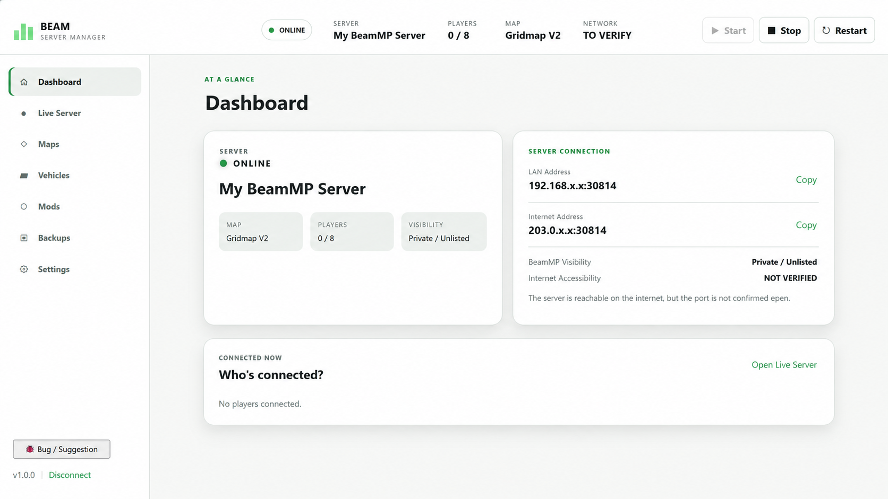
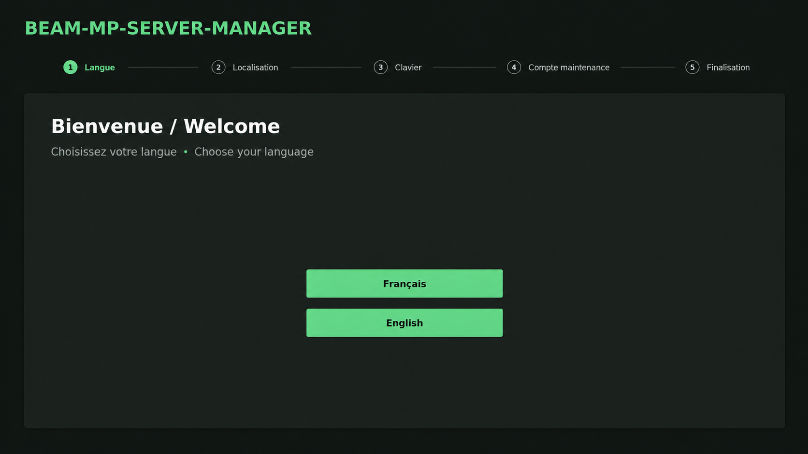
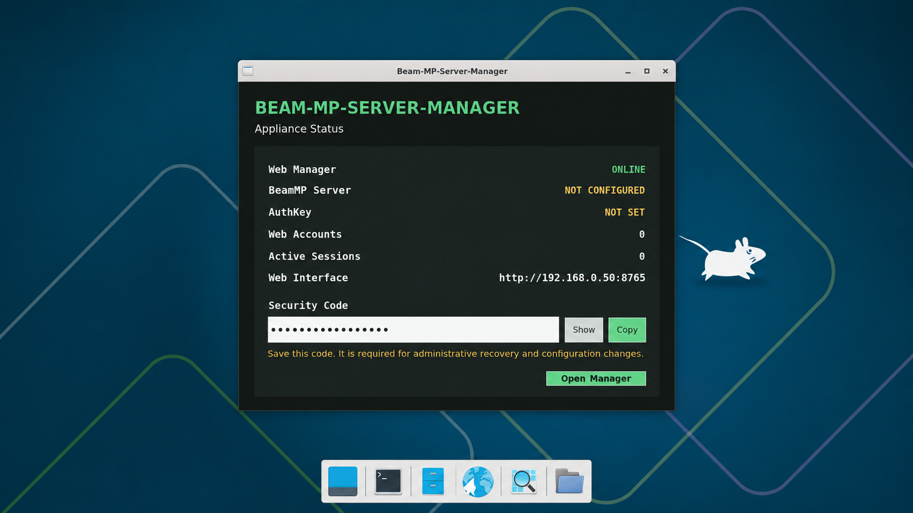
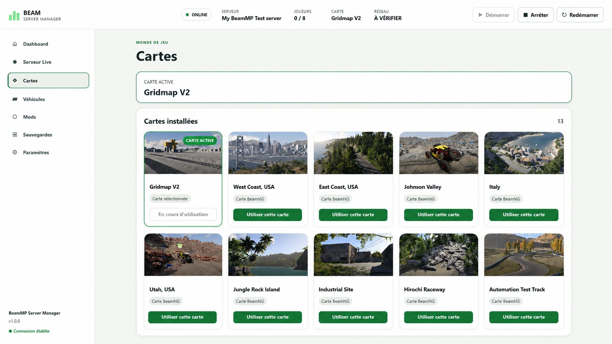
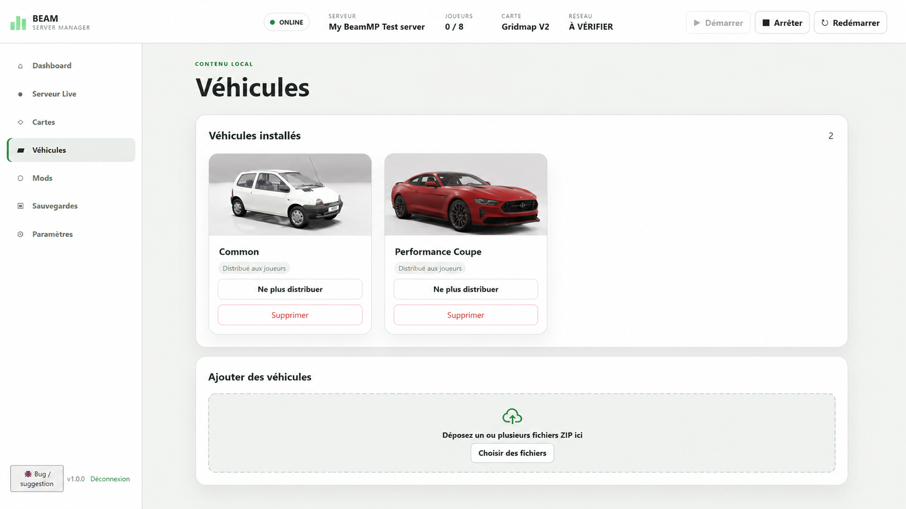
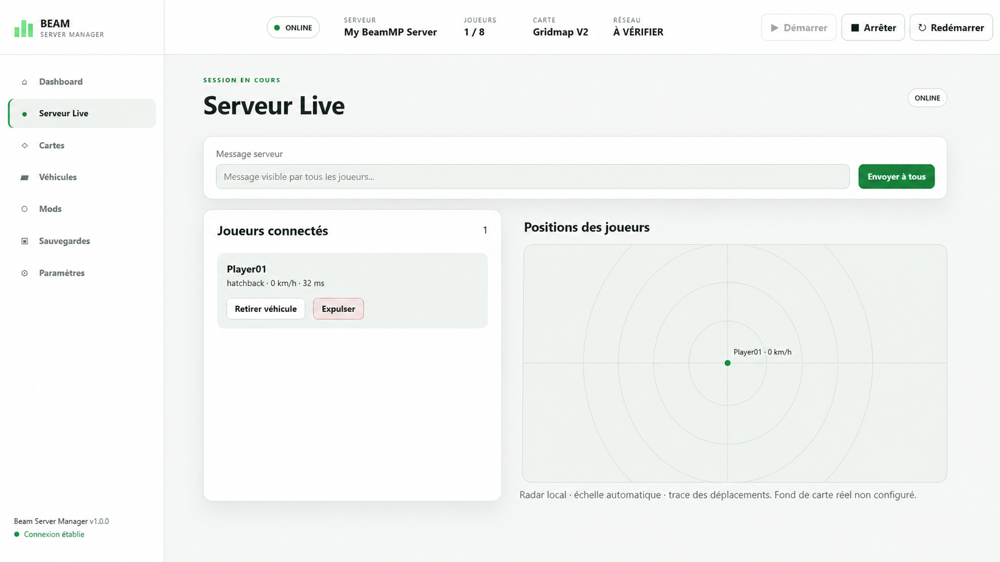
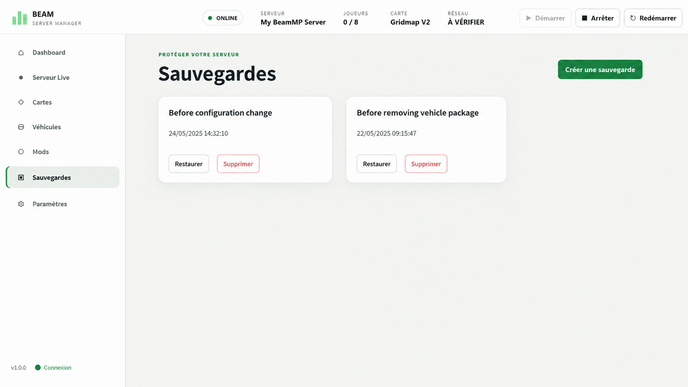
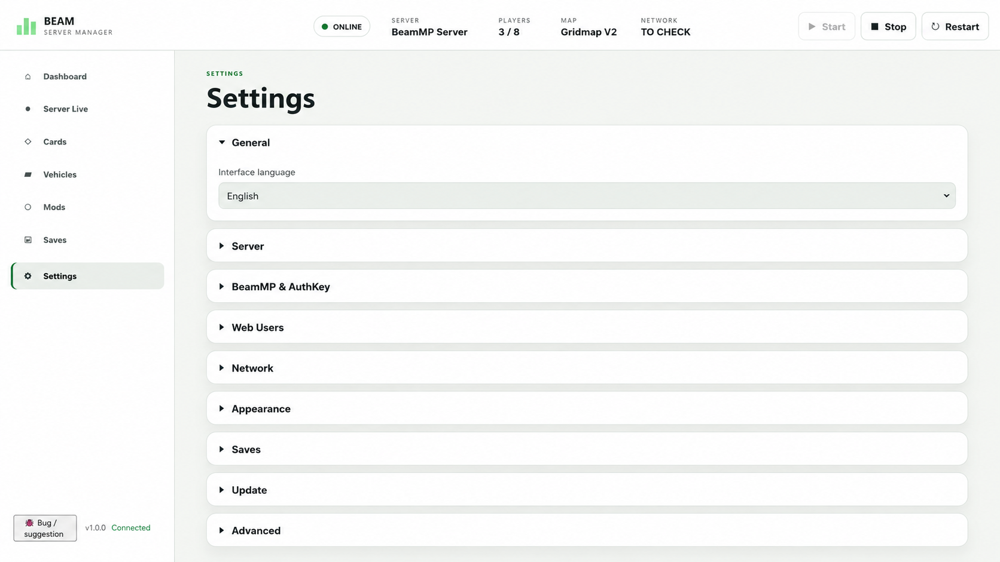

# Beam-MP-Server-Manager

> A ready-to-import VMware appliance and Web Manager for BeamMP servers.

**Current release:** `v0.11.0` · **License:** MIT · **Edition:** VMware / Debian 13 x86_64

## Download

### [⬇ Download the latest release](https://github.com/RominouVTJ/Beam-MP-Server-Manager/releases/latest)

**VMware users:** download the three `.7z` parts from the release page, place them in the same folder, open `.7z.001` with 7-Zip, extract the OVA, then import it into VMware Workstation.

[Latest release](https://github.com/RominouVTJ/Beam-MP-Server-Manager/releases/latest) · [v0.11.0 release](https://github.com/RominouVTJ/Beam-MP-Server-Manager/releases/tag/v0.11.0) · [English installation guide](docs/DEPLOYMENT_EN.md) · [Guide d'installation français](docs/DEPLOYMENT_FR.md)

Beam-MP-Server-Manager packages a preconfigured Linux environment, BeamMP Server and a graphical Web Manager into one VMware appliance.

**Import the VM, complete the guided First Run, enter your BeamMP AuthKey and manage the server from your browser.**

No Python, Git, Docker, manual TOML editing or routine SSH usage is required for normal administration.

[English](#english) · [Français](#français)

---

## Screenshots

### Dashboard



<table>
<tr>
<td width="50%">

**Guided First Run**



</td>
<td width="50%">

**Appliance status**



</td>
</tr>
<tr>
<td width="50%">

**Maps**



</td>
<td width="50%">

**Vehicles**



</td>
</tr>
<tr>
<td width="50%">

**Server Live**



</td>
<td width="50%">

**Backups**



</td>
</tr>
</table>

<details>
<summary><strong>Settings</strong></summary>



</details>

---

# English

## What is it?

Beam-MP-Server-Manager is an open-source administration interface for BeamMP servers.

The current **VMware Edition** includes:

- a preinstalled and preconfigured Debian environment;
- BeamMP Server;
- the Beam-MP-Server-Manager Web UI;
- a graphical First Run assistant;
- a local appliance status screen;
- validated Manager updates with health checks and automatic rollback.

Typical workflow:

```text
Import OVA in VMware
        ↓
Complete First Run
        ↓
Open Web Manager
        ↓
Create Web administrator
        ↓
Configure BeamMP AuthKey / server / map
        ↓
Start Server
```

## Main features

- Start, stop and restart BeamMP from the Web UI
- Server dashboard and configuration
- BeamMP AuthKey management
- Official and modded map management
- Vehicle and ZIP mod management
- Enable / disable client mod distribution
- Web users and sessions
- Backups and restore workflows
- Server Live player / vehicle / ping / speed view
- Server messages, kick and vehicle-removal controls
- French / English interface
- In-app bug / feature reporting
- Manager self-update with package validation, health checks and automatic rollback

## Download / VMware deployment

**[⬇ Download the latest release](https://github.com/RominouVTJ/Beam-MP-Server-Manager/releases/latest)**

For `v0.11.0`, download all three archive parts into the same folder:

```text
Beam-MP-Server-Manager-v0.11.0.7z.001
Beam-MP-Server-Manager-v0.11.0.7z.002
Beam-MP-Server-Manager-v0.11.0.7z.003
Beam-MP-Server-Manager-v0.11.0-SHA256SUMS.txt
```

Then:

1. Open `.7z.001` with 7-Zip.
2. Extract `Beam-MP-Server-Manager-v0.11.0.ova`.
3. Import the OVA into VMware Workstation.
4. Start the VM and complete the graphical First Run.
5. Open the Manager and configure your BeamMP server.

[Open the v0.11.0 release page](https://github.com/RominouVTJ/Beam-MP-Server-Manager/releases/tag/v0.11.0)

Full guide: [VMware deployment in English](docs/DEPLOYMENT_EN.md)

## Network ports

- BeamMP: TCP + UDP `30814`
- Web Manager: TCP `8765`

The Web Manager should normally remain LAN-only. Do not expose port `8765` directly to the public Internet without an appropriate secure access layer.

## Manager updates

`v0.11.0` is the first release containing the built-in Manager updater.

Future compatible releases can provide:

```text
Beam-MP-Server-Manager-vX.Y.Z.update.zip
```

The Manager verifies the expected GitHub Release asset and SHA-256 digest before installation. If the new Manager fails its health checks, the appliance automatically restores the previous working version.

The historical `v0.10.0` appliance predates this updater and cannot self-bootstrap to `v0.11.0` through the Web UI.

## Future Windows Edition

A native Windows Edition is planned. It will reuse the same Web UI and core.

```text
Web UI
  ↓
FastAPI / Core
  ├─ LocalLinuxBackend   → VMware Edition
  └─ LocalWindowsBackend → Windows Edition (future)
```

See [Windows Edition architecture preparation](docs/architecture/WINDOWS_EDITION_PREPARATION.md).

---

# Français

## Présentation

Beam-MP-Server-Manager est une interface d'administration open source pour les serveurs BeamMP.

La **VMware Edition** fournit directement :

- Debian préinstallé et préconfiguré ;
- BeamMP Server ;
- le Web Manager ;
- un assistant graphique de première configuration ;
- un écran local d'état de la machine ;
- les mises à jour validées du Manager avec contrôle de santé et rollback automatique.

Pour l'utilisation normale, l'objectif est de ne pas avoir besoin de Python, Git, Docker, d'édition manuelle du TOML ni de commandes SSH.

Parcours normal :

```text
Importer l'OVA dans VMware
        ↓
Terminer le First Run
        ↓
Ouvrir le Web Manager
        ↓
Créer l'administrateur Web
        ↓
Configurer AuthKey / serveur / carte
        ↓
Démarrer le serveur
```

## Fonctions principales

- Démarrage, arrêt et redémarrage de BeamMP depuis le navigateur
- Tableau de bord et configuration du serveur
- Gestion de l'AuthKey BeamMP
- Gestion des cartes officielles et moddées
- Gestion des véhicules et mods ZIP
- Activation / désactivation de la distribution des mods aux joueurs
- Utilisateurs et sessions Web
- Sauvegardes et restauration
- Vue Server Live des joueurs, véhicules, ping et vitesse
- Messages serveur, expulsion et suppression de véhicule
- Interface français / anglais
- Signalement de bug / suggestion depuis l'interface
- Mise à jour du Manager avec validation, contrôle de santé et rollback automatique

## Téléchargement / installation VMware

**[⬇ Télécharger la dernière version](https://github.com/RominouVTJ/Beam-MP-Server-Manager/releases/latest)**

Pour `v0.11.0`, téléchargez les trois parties dans le même dossier :

```text
Beam-MP-Server-Manager-v0.11.0.7z.001
Beam-MP-Server-Manager-v0.11.0.7z.002
Beam-MP-Server-Manager-v0.11.0.7z.003
Beam-MP-Server-Manager-v0.11.0-SHA256SUMS.txt
```

Ensuite :

1. Ouvrez `.7z.001` avec 7-Zip.
2. Extrayez `Beam-MP-Server-Manager-v0.11.0.ova`.
3. Importez l'OVA dans VMware Workstation.
4. Démarrez la VM et terminez le First Run graphique.
5. Ouvrez le Manager et configurez votre serveur BeamMP.

[Ouvrir la page de la release v0.11.0](https://github.com/RominouVTJ/Beam-MP-Server-Manager/releases/tag/v0.11.0)

Guide complet : [Déploiement VMware en français](docs/DEPLOYMENT_FR.md)

## Ports réseau

- BeamMP : TCP + UDP `30814`
- Web Manager : TCP `8765`

Le Web Manager doit normalement rester accessible uniquement sur le réseau local. N'exposez pas directement le port `8765` sur Internet sans couche d'accès sécurisée adaptée.

## Mises à jour du Manager

`v0.11.0` est la première version intégrant le système de mise à jour du Manager.

Les versions futures compatibles peuvent fournir :

```text
Beam-MP-Server-Manager-vX.Y.Z.update.zip
```

Le Manager vérifie l'asset GitHub Release attendu et son SHA-256 avant installation. Si la nouvelle version échoue à ses contrôles de santé, l'ancienne version fonctionnelle est restaurée automatiquement.

L'ancienne appliance `v0.10.0` est antérieure à ce système et ne peut donc pas se mettre elle-même à niveau vers `v0.11.0` depuis l'interface Web.

## Future Windows Edition

Une **Windows Edition native** est prévue. Elle réutilisera la même interface Web et le même cœur applicatif.

```text
Web UI
  ↓
FastAPI / Core
  ├─ LocalLinuxBackend   → VMware Edition
  └─ LocalWindowsBackend → Windows Edition (future)
```

Voir [la préparation de l'architecture Windows Edition](docs/architecture/WINDOWS_EDITION_PREPARATION.md).

---

## Project links

- [Download latest release](https://github.com/RominouVTJ/Beam-MP-Server-Manager/releases/latest)
- [v0.11.0 release notes](docs/releases/v0.11.0.md)
- [Changelog](CHANGELOG.md)
- [Contributing](CONTRIBUTING.md)
- [Security policy](SECURITY.md)
- [Third-party notices](THIRD_PARTY_NOTICES.md)

## License

Beam-MP-Server-Manager is released under the **MIT License**.

BeamMP Server binaries and BeamNG assets remain third-party components subject to their respective terms and are not relicensed by this repository.
